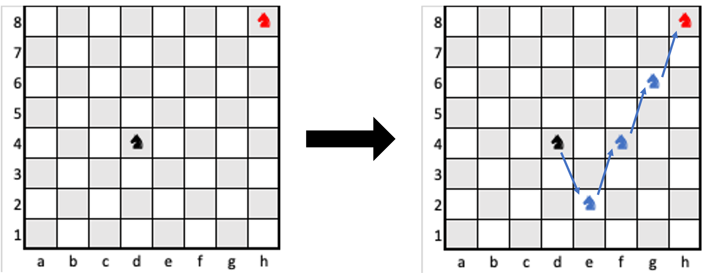

# Simple Search Algorithm for Knight ♞

This program calculates the minimum number of moves a knight needs to reach a target position on an 8×8 chessboard using recursive depth-first search. 
It generates all valid knight moves from a given position and explores paths until the target is reached. 
The shortest move sequence is determined by finding the minimum path among all possibilities.

    

This [Jupyter Notebook](solve.ipynb) shows how to use `Knight` class and solve for the minimum number of moves taken from origin to destination on a chessboard.